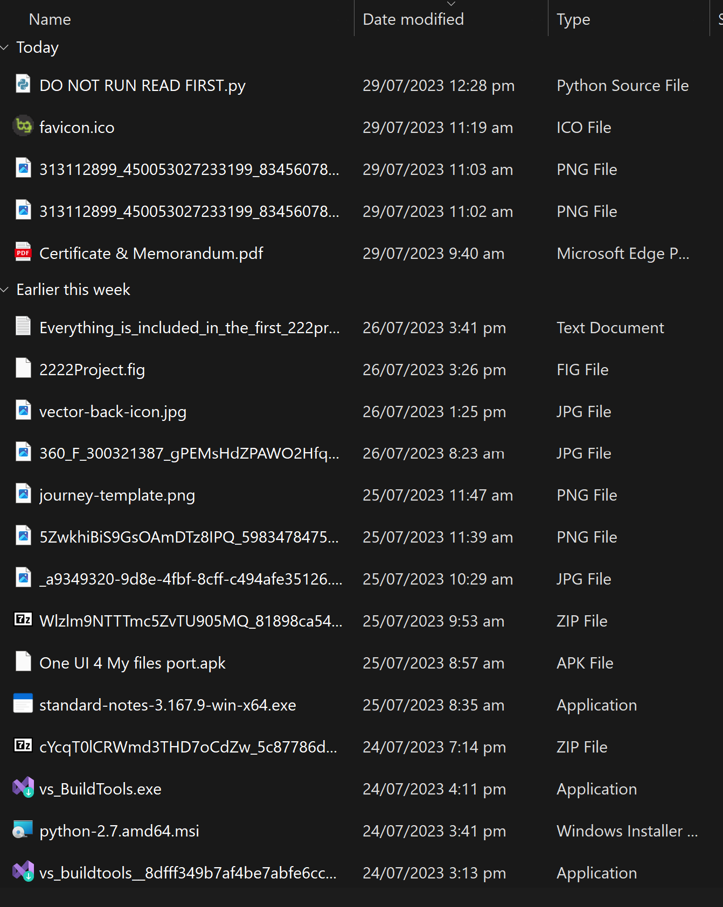
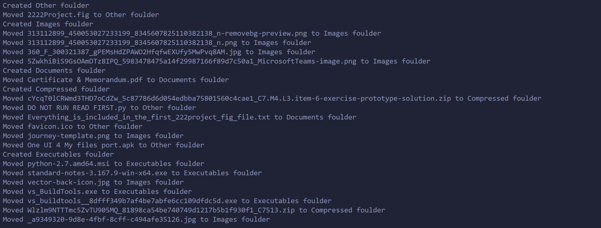
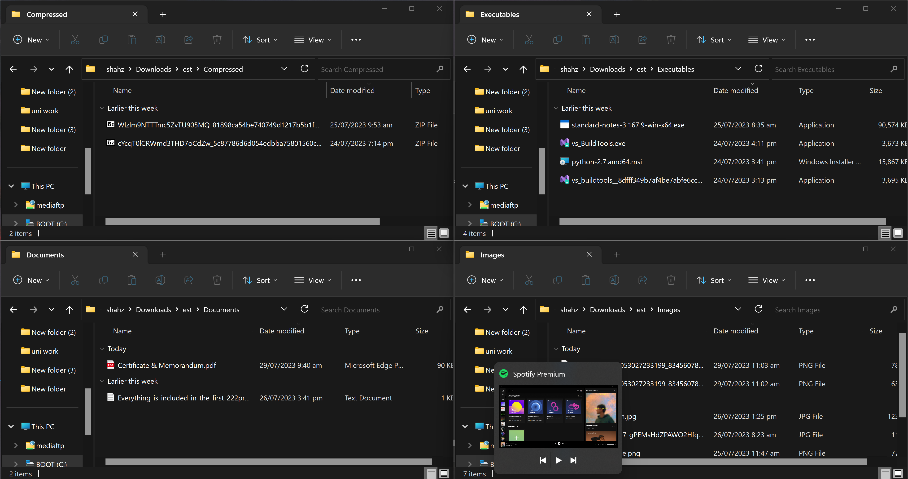

# Organization Script for Windows Download Folder

This is a simple Python script designed to help you organize your cluttered Windows Download folder. The script automatically creates subfolders based on file types and moves the corresponding files into their respective folders. Additionally, it renames the paths of other files to make them more manageable within the subfolders.

## Usage Instructions

#### Installation

```bash
git clone https://github.com/nabeelahmedjh/download-folder-automator.git
```

### Running the script

```bash
cd code
python main.py
```

## Screenshots

### Before



### Output



### After


#### Inside of folders


